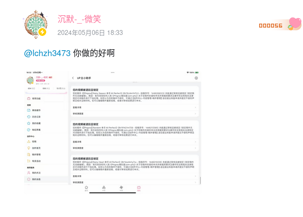
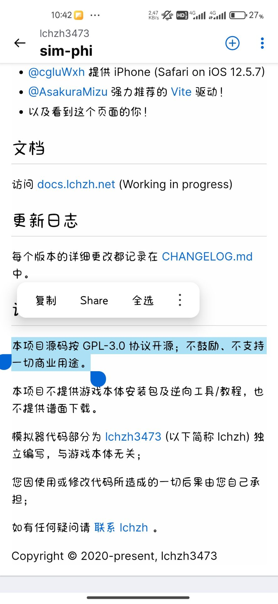
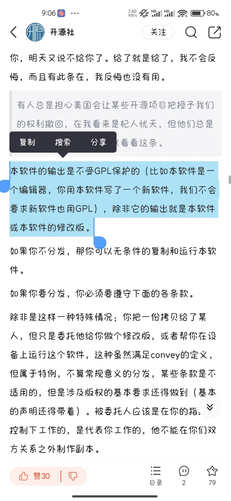

   最近lchzh3473的风波算是卷袭了整个Phi圈。起因是up[@沉默-_-微笑](https://space.bilibili.com/406599529)多个视频使用了[@lchzh3473](https://space.bilibili.com/274753872/)的模拟器的视频被lchzh以版权问题的原因而举报下架，其对此事的动态也被举报下架。
   
  

   此事之后lchzh在phi圈引发了一部分人的不满。真正使其成为众所矢之的事情，是其于其在5.6时，举报了3个@沉默-_-微笑使用Phigros官方游戏的游玩视频并且成功，至此之后，在phi圈引发了较大的风波。

   此事孰是孰非一目了然，我也不愿在此事件上纠结过多;但是值得注意的是，lchzh3473的sim-phi使用了GPLv3的licence。作为使用了自由软件的许可证的程序，lch制定各种手元视频附带要求的合理性我觉得十分有必要讨论。

   既然sim-phi使用了GPLv3的licence，这也就意味着simphi是作为自由软件发布的，本协议明确确认你不受限制地运行未修改的程序的权利。仅在输出内容构成受保护的作品时，运行受保护的作品所产生的输出受本协议的约束。GPL的核心精神便是使用自由软件。根据GPLv3的第二项：基本权利的原文：“This License explicitly affirms your unlimited permission to run the unmodified Program. The output from running a covered work is covered by this License only if the output, given its content, constitutes a covered work. ”（本协议明确确认你不受限制地运行未修改的程序的权利。仅在输出内容构成受保护的作品时，运行受保护的作品所产生的输出受本协议的约束。），

   
  
   由上，我认为lzhch3473要求游玩者发布视频时必须标注作者名字是完全不符合GPL的规定的，哪怕是作者本人发布的也不符合，因为simphi是以gpl发行的。很明显，模拟器游玩的录制视频是属于程序输出内容的，而输出内容（铺面的内容和借此录制的视频手元）并不包括模拟器的源代码以及模拟器程序的本身（视频并不是模拟器本体吧）。不知道@lzhch3473怎么看？

   作为开源软件的开发者，我认为lchzh3473的行为不仅仅是伤害到了phi自制圈，也是对整个开源圈子的一种伤害。由此我坚决抵制lchzh3474使用着gpl协议但是又违反着它的行为。
  
   Tip：根据GPLV3第二条基本许可，“根据本协议授予的所有权利的期限为程序的版权期限，此等授权在满足条件的情况下是不可撤销的。”由此更改许可证的方法也是无效的。
  
   如果认为我上述辩论有缪误，欢迎来与我和平讨论，我将对此做出修改。

***

2024.12.20二编：

很惊讶我随手写的文章成为了我网站被bing搜索最多次的文章，并且输入“lchzh3473怎么了”，“lchzh3473事件”这些词都被bing列在了结果的前列

照着这种趋势，我估计我要被lchzh3473拉黑一辈子了XD