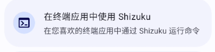
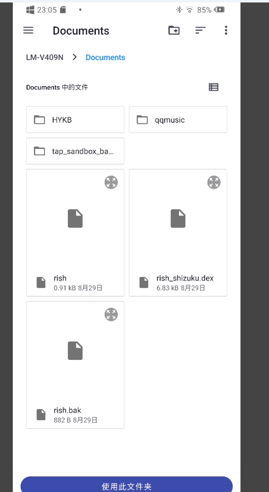
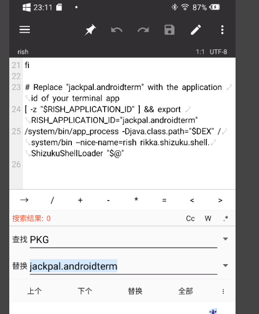

最近有一位朋友试图使用外接TF卡来拯救自己的所剩无几的内存，但是又苦于没有电脑。那好吧！能不能使用shizuku呢？于是就有了这篇文章。

首先，就是安装并且激活shizuku。这一步我想大家都会，因此我也不在此过多论述

其次，给第三方终端激活shizuku：

如果要不使用adb使用shell命令，那必然离不开shizuku。但是并不是每一个shell都接入了shizuku，那么怎么办呢？

不知道从何时起，shizuku支持了rish————从shizuku导出一个shell文件来访问shizuku：
><del>Rish is an Interactive SHell for android</del>

   

那么事情就变简单了，使用终端访问rish文件即可获得shell权限：

使用shizuku导出rish文件到你喜欢的目录，这里我选择直接导出到documents文件夹


随后，你需要获取到你喜欢的终端软件的包名在这里，我选择了终端模拟器（jackpal.androidterm）,

我们需要在rish中，单独给予这个终端软件访问shizuku的权限：使用mt管理器等软件，使用文本方法打开rish，右上角使用替换，把所有的PKG替换为终端包名，随后保存rish文件。从此一个此终端专用的shell就这样做好了



接下来使用终端打开shell文件：为了避免终端打开不了其他文件，先给予终端访问所有文件的权限，然后新建一个窗口，使用命令
```sh
cd /storage/emulated/0/Documents/
```

来使终端打开到这个放了rish的文件夹，当然你的路径可能和我不一样

使用 
```sh
sh ./rish
```

来激活shizuku。出现授权便是激活成功了(只会在第一次提示)。不过此后每次你要用都得这样激活一次

接下来便是和adb的步骤大同小异了，只不过省略了电脑需要的adb shell前缀：

首先使用
```sh
sm list-disks
```

获取你所访问的sd卡的磁盘名，执行完之后，屏幕可能显示：
```sh
disk:179,32
```

获取到的就是你的磁盘名，你的可能和我不一样

使用命令开始分盘：

```sh
sm partition disk:179,32 mixed 40
```
这个地方的mixed 50代表留下40%的空间用来留给文件，60%存软件，你可以根据自己的喜好来决定这个内存，然后这个地方要写你的磁盘名，我的可能和你不一样

执行完会稍微有一小段停顿，意味着正在执行。出来下一行命令开始让你输入时候就意味着代码已经执行完毕了，可以前往设置看看有没有成功了

然后的话...如果你运气好，可能可以看见手机的设置出现了移动app到内存卡，那就可以直接移动了。运气不好的，可以尝试使用“打开快捷方式app”，然后显示系统应用，设置，存储（或者类似的词）看看能不能调用软件移动的接口。你可能还需要前往开发者模式，翻到最底下，然后打开强制允许将应用写入外部存储设备。大概就是这样。

再不行的话...也许你应该使用命令

```sh
sm partition disk:179,32 public
```
来让他回到一张正常的sd卡，还是放过他吧————还有不要忘记把磁盘名字改成你自己的磁盘名字！