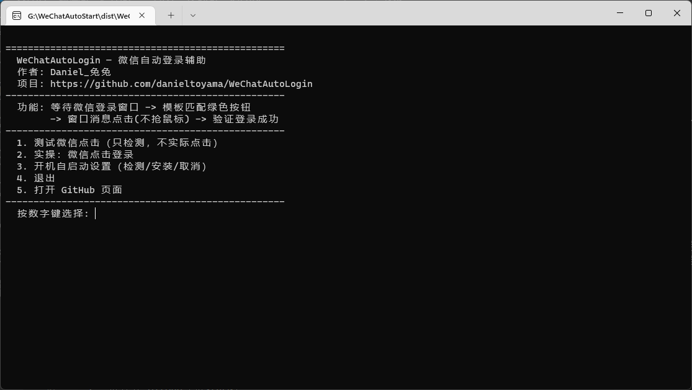

你有没有遇到过这种情况：电脑一开机，微信设了开机启动，自己蹦出来了，结果还卡在登录页等你点那个绿色的大按钮。但凡忘记了，他就一直在后台待着

微信老早就支持所谓“自动登录”，结果这么多年过去了，还是不能电脑打开了，微信自己登录上，只好写个工具自己动手了

我的需求其实很简单：

1. 微信开了，检测到登录页，自动登录
2. 不要抢鼠标，尽可能安静的解决。不然可能造成意外的问题

第二点是我特意做的设计，很多"自动点击"类的软件，原理基本都是模拟鼠标移动去点。但凡你在用电脑，点击就丢了，要么就点歪。所以这次我换了个思路：**直接给微信窗口发一条"点击"消息**，就好比程序转发了一次鼠标事件。微信确实登录成功了，然后鼠标完全不受干扰，你鼠标怎么晃都没影响，被别的窗口挡住了，在后台它也能点到（消息是点对点发给窗口的嘛）。

然后程序会检测微信状态，检测到成功就会自动退出后台。

功能上现在是这样：双击 exe 会弹出菜单，按数字键运行：

- 1 测试 （用于识别目前的微信窗口状态，是否能读取到登录键）
- 2 实操 （直接试试能不能点击微信按钮）
- 3 开机自启设置（检测自启功能启动状态，安装/取消都自动弹 UAC）
- 5 一键打开 GitHub（求star~）

 [github开源链接](https://github.com/danieltoyama/WeChatAutoLogin)
 
 [蓝奏云下载](https://danieltoyama.lanzouu.com/iRdFq477kyeh)   密码:h84x

可以选择从构建运行，或者直接使用蓝奏云的exe。就是体积有点大，python嘛，没办法

可以的话记得点个star支持一下我喔